# 자바 프로그래밍 과정 by 김일국 강사

### 커리큘럼
- 교재명:Power Java Compact, 출판사: 인피니트 북스
- 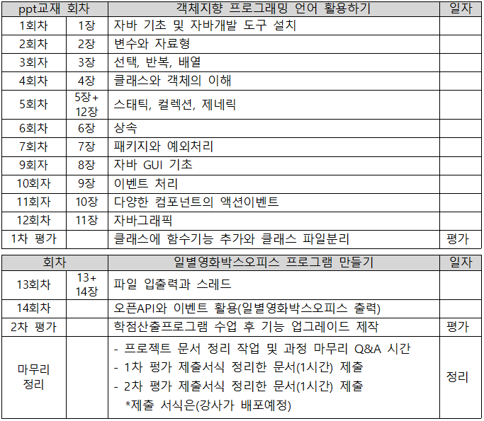
- [Power Java 책의 강의용 PDF자료](https://drive.google.com/drive/folders/15-fAFBglfngKQ82M6DiD1Jgwc31UXRm7?usp=sharing)
```
- 과목소개(아래)
일반적으로 공공기관이나 은행과 같이 신뢰가 필요하거나, 효율성이 높은 곳에서 사용하는 
응용 소프트웨어 개발에 적합한 언어 및 개발환경으로 자바 언어 기반 스프링 프레임워크나
안드로이드 개발환경을 사용하고 있습니다.
따라서 본 과목에서는 스프링 기반 웹 프로그램을 구현하거나 안드로이드 기반 모바일 앱을 
구현할 때 기반이 되는 개발환경과 자바 프로그램 언어의 습득을 과목의 목표로 합니다.
- 과목 초반부는 
* 이클립스 기반의 자바 개발환경을 설치하고 콘솔 창에 "안녕하세요" 문자를 출력하는 
자바 프로그램을 만드는 기초부터 시작하여 단계별로 자바 프로그램을 만들어 봅니다.
자료 형 별 변수와 선택, 반복, 배열 구문 및 클래스와 객체의 사용, 
상속과 예외처리의 순서로 구현하게 됩니다.
- 과목 중반부는
* PC용 GUI 윈도우용 프로그램에서 필수로 사용되는 자바 swing 라이브러리에서 
버튼, 텍스트박스, 선택박스 등의 다양한 컴포넌트를 활용한 이벤트 코딩을 해 본니다. 
그리고, 간단하게 자바에서 그래픽 구현은 어떻게 하는지 알아 보게 됩니다.
또한, 윈도우용 전자계산기 프로그램을 구현해 보면서 메서드의 
다양한 사용법에 대해서 학습하게 됩니다.(아래 미리보기 이미지)
```
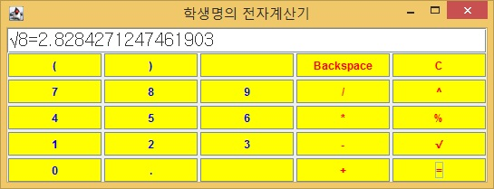
```
- 과목 후반부는
* 파일 입출력 스트림 기능에 대해서 알아 보고 윈도우용 메모장 프로그램으로 
기능을 구현해 봅니다. 그리고, 간단하게 자바에서 멀티 스레드 구현은 어떻게 
하는지 알아 보게 됩니다.(아래 미리보기 이미지)
```
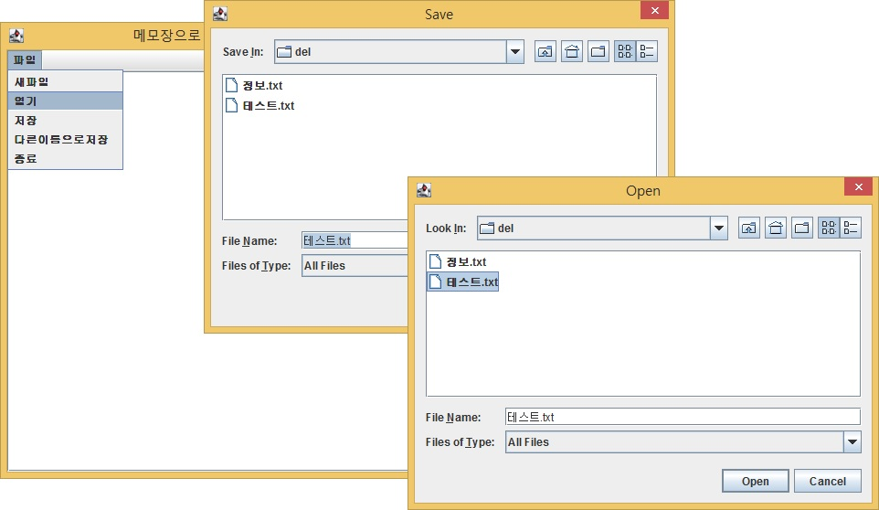
```
또한, 최근에 유행하는 오픈API 서비스를 자바기반의 RestAPI 통신으로 가져와서 
일별 영화 박스오피스를 출력하는 프로그램을 제작해 보게 됩니다.
(아래 미리보기 이미지)
```
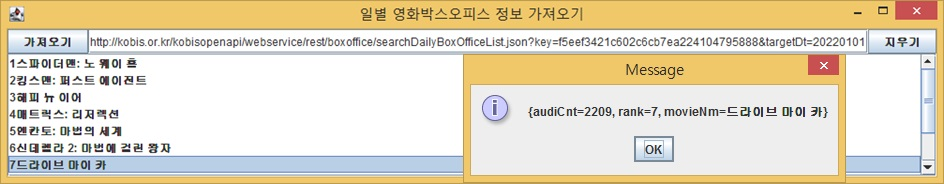

#### =====================================================
### 커리큘럼(예전자료_상단에 최신 자료를 이용해서 수업)
- 1차 코스(아래) 교재사용:Power Java Compact,출판사: 인피니트 북스
- 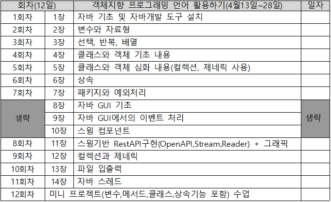
- [Power Java 책의 강의용 PPT자료](https://drive.google.com/drive/folders/15-fAFBglfngKQ82M6DiD1Jgwc31UXRm7?usp=sharing)
- [Power Java 책의 mini project(수업에서진행) 소스답안](https://github.com/miniplugin/ezen/tree/main/src/miniproject)
- [Power Java 책의 이론exercise와 실습exercise은(학생개인진행)소스답안](https://github.com/miniplugin/ezen/tree/main/src/exercise)

- 2차 코스(아래)
- 

### 참고사항
- 1차코스 교재의 1장~7장 사이는 자바프로그램의 기초로 클래스를 사용하는 방법을 학습합니다. 각 장의 이론강의 중 1개 이상의 실습으로 진행 하게 됩니다.
- 교재 8장~14장에서 사용하는 스윙(Swing) 라이브러리 기반 개발환경으로 PC용 프로그램으로 개발트렌드는 아니지만 모바일App제작과 유형이 비슷하다.
```
참고로, 스프링(Spring) 라이브러리 기반 개발환경: 웹(API서버) 프로그램(개발트렌드)
참고로, 안드로이드X(AndroidX) 라이브러리 기반 개발환경: 모바일 앱(App) 프로그램(개발트렌드)
그래서, 8장~14장은 빠르게 진행할 예정입니다. 대신에 필수로 알아야 할 내용은 수업 중 실습으로 진행할 예정 입니다.
```
- 각 장의 PPT수업에서 실습한 내용 중 필수로 알아야 할 내용을 실습소스만으로 정리(아래 소스 링크).
- [자바리뷰학습자료 강의용소스 링크](https://github.com/miniplugin/ezen/tree/main/src/basic)

- [구름 코딩테스트 링크 응시환경 체험하기](https://devth.goorm.io/)
- 10장 그래픽스 클래스에 사용되는 기초지식 아래
- 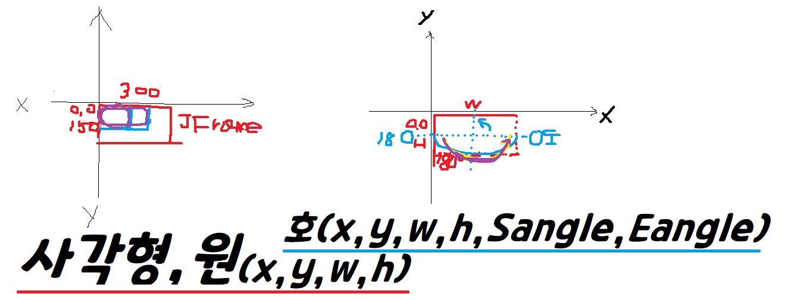
- [13장 버퍼와 파일업로드 웹에서 사용하는 곳](https://github.com/kimilguk/kimilguk-boot2/blob/boot14_03/src/main/java/com/herokuapp/kimilgukboot2/util/FileUtilsApi.java)
- [14장의 동시작업의 문제점 웹에서 보완하는 방법:트랜잭션사용](https://github.com/miniplugin/kimilguk-spring5/blob/master/src/main/java/com/edu/service/BoardServiceImpl.java)
- [14장의 싱크로나이즈 동기화 웹에서 사용하는 곳](https://github.com/kimilguk/kimilguk-boot2/blob/boot14_03/src/main/resources/static/js/app/index.js)
- [14장의 노티파이 알림 앱에서 사용하는 곳](https://github.com/miniplugin/SingleDiary/blob/dev_api/app/src/main/java/org/techtown/diary/Fragment1.java)

### 1차 코스에서 교재 마지막14장의 mini project 미리보기(1장~7장 기반 프로그램으로 대체예정)
- mini project 프로그램 결과.(아래)
- 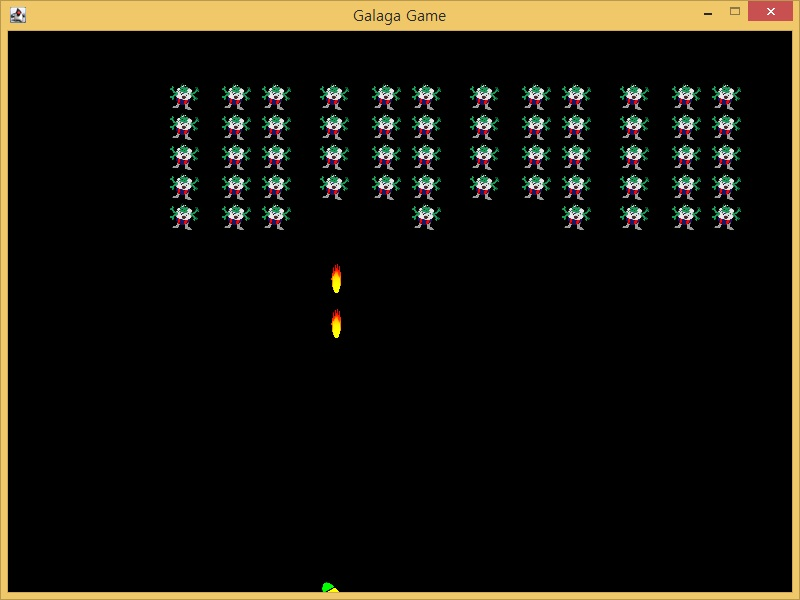
- mini project 프로그램 클래스 다이어그램.(아래)
- 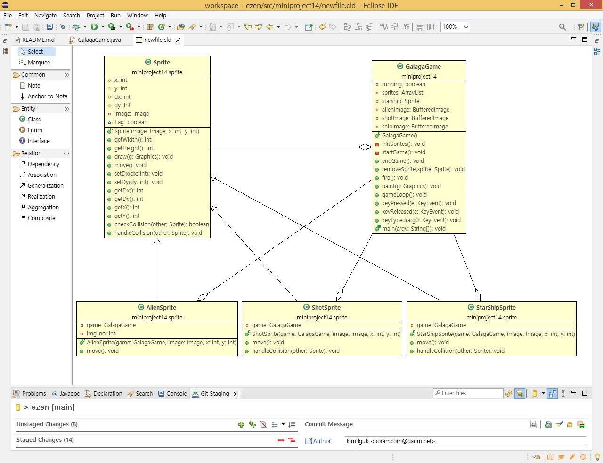

### 2차 코스에서 자바로 만든 학점 산출 프로그램을 미리보기(수업시간에 같이 진행예정)
- 학점 산출 프로그램 1차 결과 아래.(2차결과는 학생이 작업예정)
- 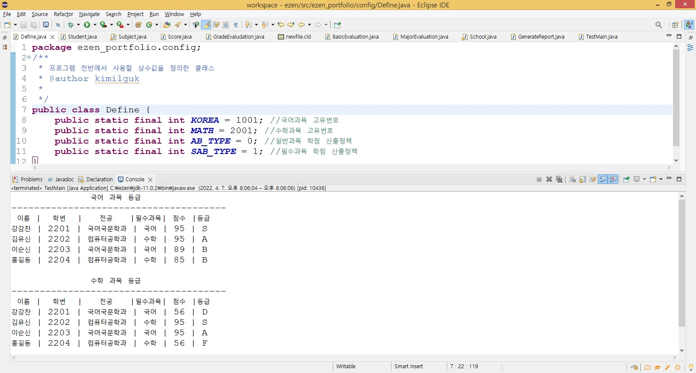
- 학점 산출 프로그램 클래스 다이어그램.(아래)
- 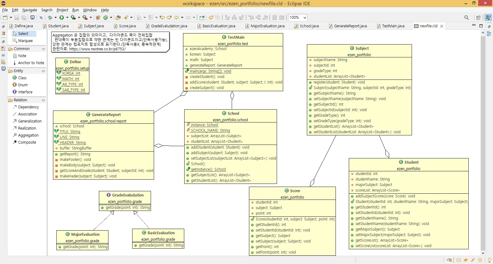

#### 개발환경 통일(ppt수업 진행 시 참조)
- 오픈소스 자바 11로 통일: C:\ezen 폴더에 압축을 푼다.
- 이클립스는 최신 버전으로 설치: C:\ezen 폴더에 설치한다. 설치시 JVM 위치를 자바설치 폴더를 지정한다.
- 이클립스 최초 실행시 아래 설정 부터 처리 한다.
/**
 * 이클립스 설치 후 최초 window -> preferences 설정창에서 환경설정 작업 아래 4가지 필수
 * 검색어(encoding): UTF8로 변경, 
 * 검색어(font): basic 16px로 변경, 
 * 검색어(assist): Auto Activator 항목에 다음 텍스트 입력 <=$:.@qwertyuioplkjhgfdsazxcvbnm_QWERTYUIOPLKJHGFDSAZXCVBNM
 * Disable insertion triggers except 'Enter'
 * 아래는 클래스 다이어그램(클래스 구조도)확인하는 플러그인 설치
 * Help -> Install New Software,.. -> Work with 에 https://takezoe.github.io/amateras-update-site 입력 후 엔터 -> Modeler 선택
 */
 - 앞으로 사용할 프로젝트명은 ezen 으로 한다.

### 수업 참고 자료
- 구름코딩테스트 순서도: [구글다이어그램사용: 구글로그인필요](https://drive.google.com/drive/folders/1854Nmo6cAfqdQlzEhx53sxCjr7mHN-Cg?usp=sharing)
- 구름코딩테스트 소스: [자바소스: 위 다이어그램번호와 매칭시켜서 공부](https://github.com/miniplugin/JavaLang/tree/master/project)
- 스프링부트에서 클래스를 거쳐서 저장한 테이블내용.(아래)
- [LocalDateTime 클래스 시간이 사용된 스프링소스 링크](https://github.com/kimilguk/kimilguk-boot2/blob/boot14_03/src/main/java/com/herokuapp/kimilgukboot2/domain/BaseTimeEntity.java)
- 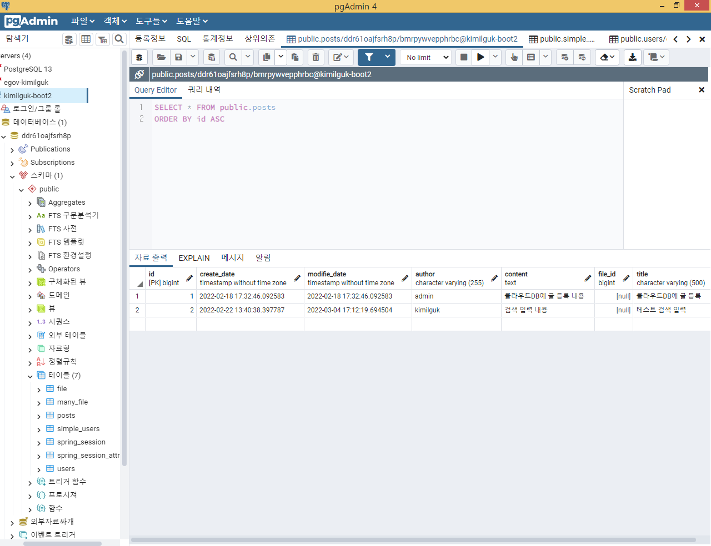

### 수업에서 학생과 함께 작업한 소스와 과제물 제출 서식 2가지 워드문서(아래)
- [수업에서 학생과 함께 작업한 소스](https://github.com/kimilguk/ezen)
- [문제해결시나리오_제출서식](https://docs.google.com/document/d/17gvnoZe6gB-mlGJpqAaKregZqYLc0tg-/edit?usp=sharing&ouid=114190689644503551692&rtpof=true&sd=true)
- [포트폴리오_제출서식](https://docs.google.com/document/d/1w8oSjZrdlh8O5YgvX81xnVFBQxWh6Lr9/edit?usp=sharing&ouid=114190689644503551692&rtpof=true&sd=true)

### 학생PC 준비사항
#### 대면수업 시 프로젝트 내용이 자세히 보이지 않을 때 교사PC 화면공유 무료 프로그램 활용(아래)
- https://www.freeconferencecall.com/ 다운로드: https://drive.google.com/file/d/1ZGj8EbbzSkqJYDkA-rnHoqLXYhLjeFN1/view?usp=sharing
- 학생들은 아래 화면 순서대로 사용
- JOIN 으로 접속(아래)
- 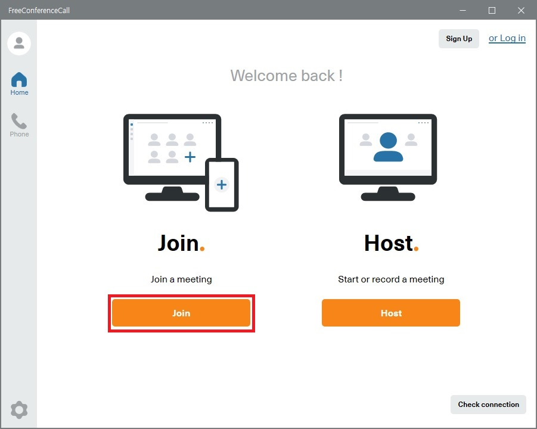
- 학생이름과 접속ID(kimilguk 교수id로 고정) 2곳만 입력한다(아래)
- 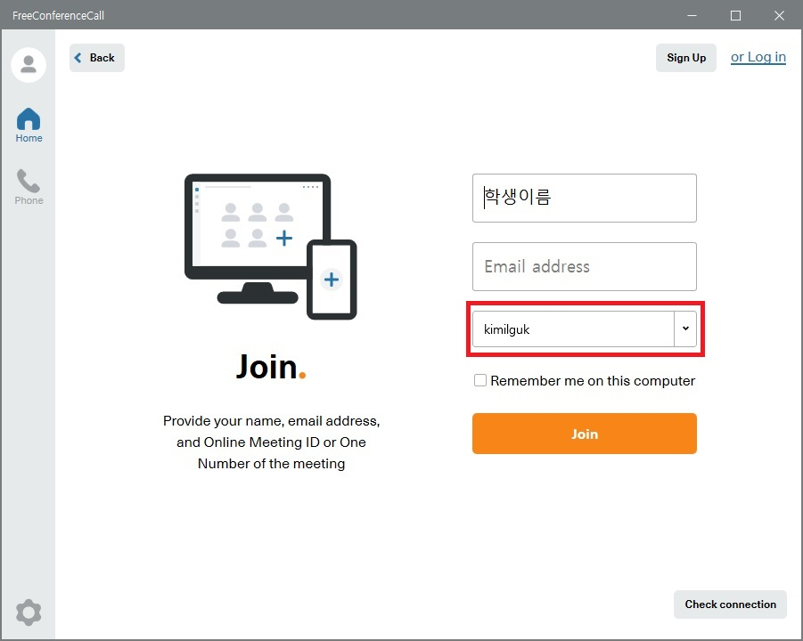
- 접속 후 하단의 I Will decide later 선택(아래)
- 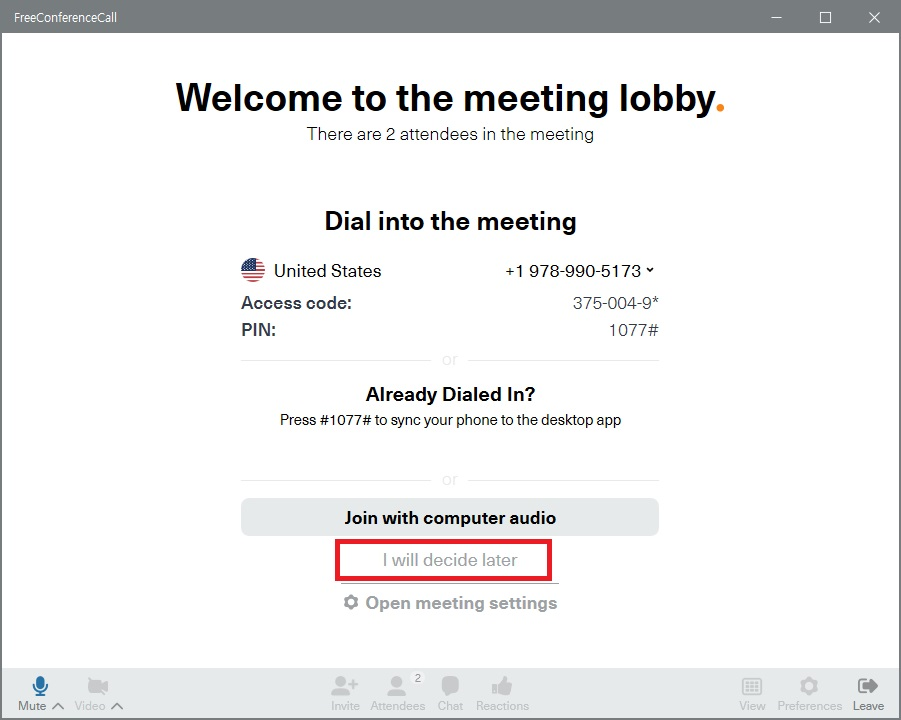
- 강사 화면을 보면서 강의를 들으시면 됩니다.(아래)
- 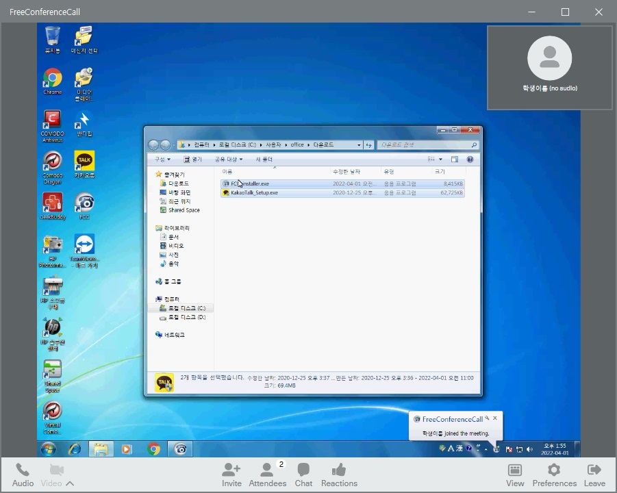
- 채팅사용 됩니다.(아래)
- 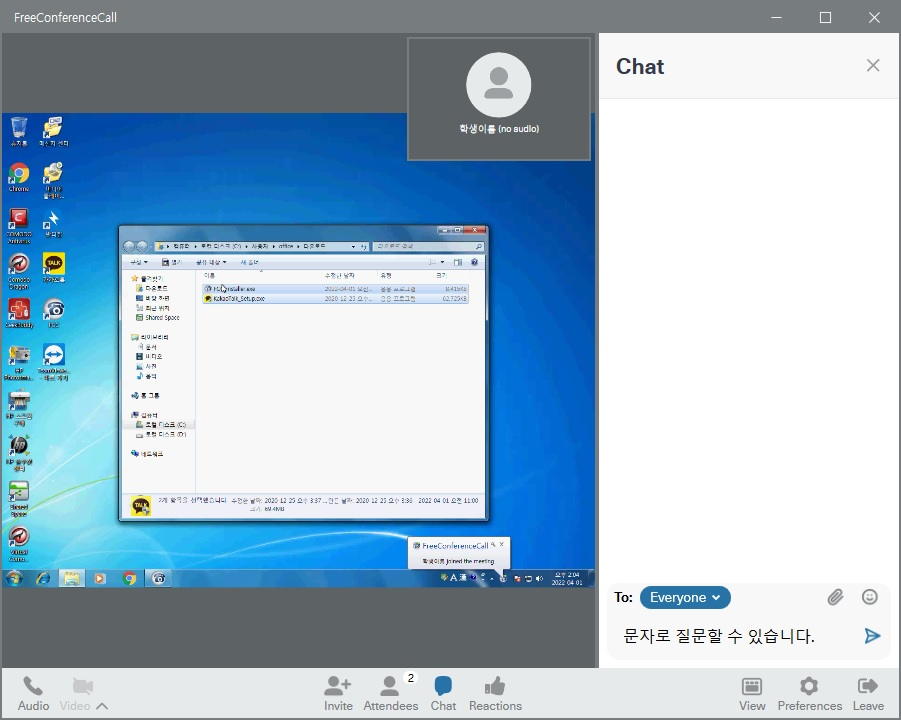

#### 비대면수업 시 줌 활용:
- Zoom 클라이언트 다운로드: https://zoom.us/download
- 줌에서 학생PC의 소스를 원격으로 수정하는 것은 버벅거리니, 줌에서는 강의만 합니다.
- 소스 에러 수정 요청은 아래 사이트에서 무료 원격 프로그램인 AnyDesk 를 다운로드 받을 수 있습니다.(Download Now 버튼 클릭)
- https://anydesk.com/en (설치하지 마시고 실행만 시키세요, 화면에 보이는 숫자 주소만 알려 주시면 설치 필요없이 제가 원격으로 접속가능합니다.)
- 줌으로 학습하는 다른 학생들도 여러 에러 상황을 같이 확인할 수 있게 됩니다.
- 애니데스크 실행 후 이 워크스테이션 주소를 강사에게 알려주면 된다.(아래)
- 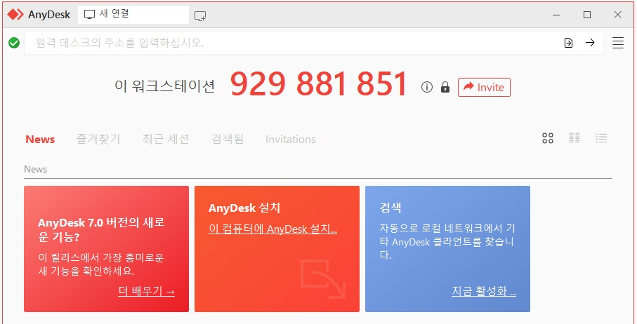
