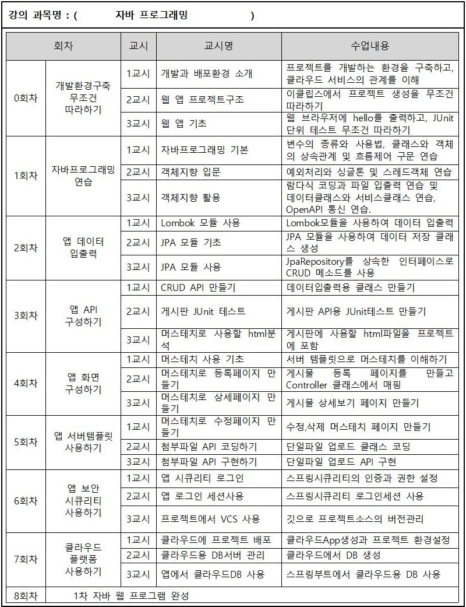
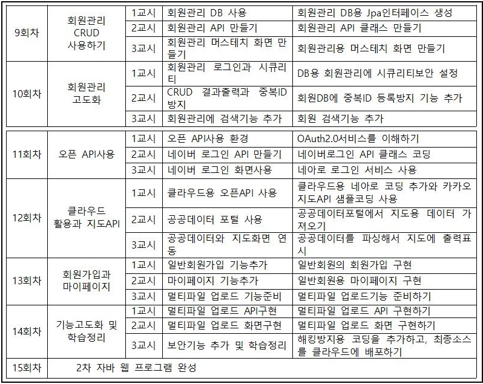

# ezen 아카데미 과정 by 김일국 강사
## 자바 프로그래밍
### 커리큘럼
- 1차 코스(아래)
- 
- 2차 코드(아래)
- 

### 학생PC 준비사항
#### 대면수업 시 교사PC 화면공유 무료 프로그램 활용(아래)
- https://www.freeconferencecall.com/ 다운로드: https://drive.google.com/file/d/1ZGj8EbbzSkqJYDkA-rnHoqLXYhLjeFN1/view?usp=sharing
- 학생들은 아래 화면 순서대로 사용
- JOIN 으로 접속(아래)
- 
- 학생이름과 접속ID(kimilguk 교수id로 고정) 2곳만 입력한다(아래)
- 
- 접속 후 하단의 I Will decide later 선택(아래)
- 
- 강사 화면을 보면서 강의를 들으시면 됩니다.(아래)
- 
- 채팅사용 됩니다.(아래)
- 

#### 비대면수업 시 줌 활용:
- Zoom 클라이언트 다운로드: https://zoom.us/download
- 줌에서 학생PC의 소스를 원격으로 수정하는 것은 버벅거리니, 줌에서는 강의만 합니다.
- 소스 에러 수정 요청은 아래 사이트에서 무료 원격 프로그램인 AnyDesk 를 다운로드 받을 수 있습니다.(Download Now 버튼 클릭)
- https://anydesk.com/en (설치하지 마시고 실행만 시키세요, 화면에 보이는 숫자 주소만 알려 주시면 설치 필요없이 제가 원격으로 접속가능합니다.)
- 줌으로 학습하는 다른 학생들도 여러 에러 상황을 같이 확인할 수 있게 됩니다.
- 애니데스크 실행 후 이 워크스테이션 주소를 강사에게 알려주면 된다.(아래)
- 
