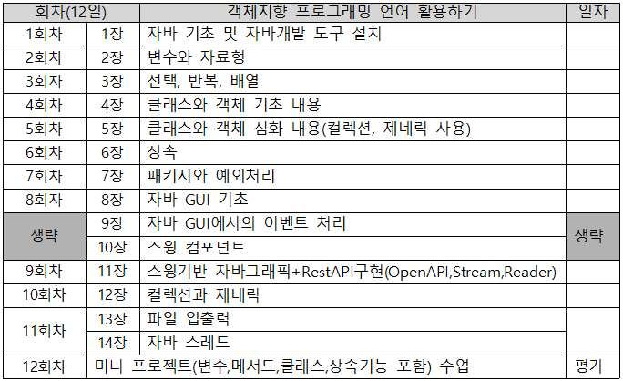
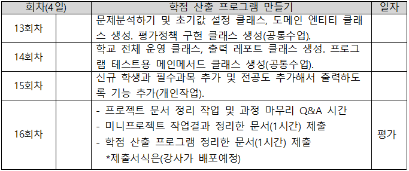

# 자바 프로그래밍 과정 by 김일국 강사

### 커리큘럼
- 1차 코스(아래) 교재사용:Power Java Compact,출판사: 인피니트 북스
- 
- [Power Java 책의 강의용소스 링크:소스폴더 ppt01~ppt14 사이](https://github.com/miniplugin/ezen/tree/main/src)

- 2차 코스(아래)
- 

### 참고사항
- 1차코스 교재의 8장~14장(7일) 사이는 PC용 그래픽 프로그램으로 클래스를 사용하는 방법을 진행합니다.
- 그래서, 8장~14장(7일)은 빠르게 진행하고 시간이 있다면 추가로 아래 소스로 강의를 진행 할 수도 있다.
- [자바리뷰학습자료 강의용소스 링크](https://github.com/miniplugin/ezen/tree/main/src/basic)

### 1코스에서 교재의 마지막 14장의 mini project 미리보기(1장~7장 기반 프로그램으로 대체예정)
- mini project 프로그램 결과.(아래)
- 
- mini project 프로그램 클래스 다이어그램.(아래)
- 

### 2코스에서 자바프로그래밍 학점 산출 프로그램 미리보기(수업시간에 같이 진행예정)
- 학점 산출 프로그램 1차 결과 아래.(2차결과는 학생이 작업예정)
- 
- 학점 산출 프로그램 클래스 다이어그램.(아래)
- 

#### 개발환경 통일(ppt수업 진행 시 참조)
- 오픈소스 자바 11로 통일: C:\ezen 폴더에 압축을 푼다.
- 이클립스는 최신 버전으로 설치: C:\ezen 폴더에 설치한다. 설치시 JVM 위치를 자바설치 폴더를 지정한다.
- 이클립스 최초 실행시 아래 설정 부터 처리 한다.
/**
 * 이클립스 설치 후 최초 window -> preferences 설정창에서 환경설정 작업 아래 4가지 필수
 * 검색어(encoding): UTF8로 변경, 
 * 검색어(font): basic 16px로 변경, 
 * 검색어(assist): Auto Activator 항목에 다음 텍스트 입력 <=$:.@qwertyuioplkjhgfdsazxcvbnm_QWERTYUIOPLKJHGFDSAZXCVBNM
 * Disable insertion triggers except 'Enter'
 * 아래는 클래스 다이어그램(클래스 구조도)확인하는 플러그인 설치
 * Help -> Install New Software,.. -> Work with 에 https://takezoe.github.io/amateras-update-site 입력 후 엔터 -> Modeler 선택
 */
 - 앞으로 사용할 프로젝트명은 ezen 으로 한다.

### 학생PC 준비사항
#### 대면수업 시 프로젝트 내용이 자세히 보이지 않을 때 교사PC 화면공유 무료 프로그램 활용(아래)
- https://www.freeconferencecall.com/ 다운로드: https://drive.google.com/file/d/1ZGj8EbbzSkqJYDkA-rnHoqLXYhLjeFN1/view?usp=sharing
- 학생들은 아래 화면 순서대로 사용
- JOIN 으로 접속(아래)
- 
- 학생이름과 접속ID(kimilguk 교수id로 고정) 2곳만 입력한다(아래)
- 
- 접속 후 하단의 I Will decide later 선택(아래)
- 
- 강사 화면을 보면서 강의를 들으시면 됩니다.(아래)
- 
- 채팅사용 됩니다.(아래)
- 

#### 비대면수업 시 줌 활용:
- Zoom 클라이언트 다운로드: https://zoom.us/download
- 줌에서 학생PC의 소스를 원격으로 수정하는 것은 버벅거리니, 줌에서는 강의만 합니다.
- 소스 에러 수정 요청은 아래 사이트에서 무료 원격 프로그램인 AnyDesk 를 다운로드 받을 수 있습니다.(Download Now 버튼 클릭)
- https://anydesk.com/en (설치하지 마시고 실행만 시키세요, 화면에 보이는 숫자 주소만 알려 주시면 설치 필요없이 제가 원격으로 접속가능합니다.)
- 줌으로 학습하는 다른 학생들도 여러 에러 상황을 같이 확인할 수 있게 됩니다.
- 애니데스크 실행 후 이 워크스테이션 주소를 강사에게 알려주면 된다.(아래)
- 