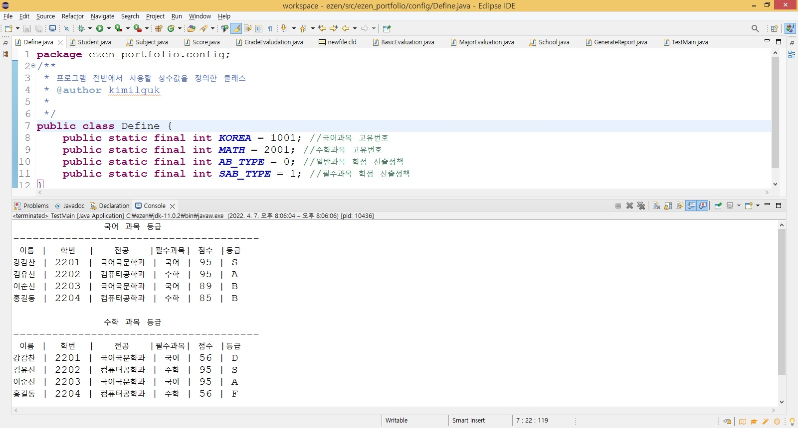

# 자바 프로그래밍 과정 by 김일국 강사

## 포트폴리오형 문제

### 이젠 아카데미 학교가 있습니다. 이 학교에는 4명의 학생들이 수업을 듣습니다. 과목은 국어와 수학이 있고, 각 학생은 두 과목을 모두 수강합니다. 학교에 전공은 컴퓨터공학과 국어국문학 두 가지가 있습니다. 컴퓨터공학과 학생은 수학이 필수과목이고, 국어국문학과 학생은 국어가 필수 과목입니다.단 학생별로 한 개의 전공과목을 선택합니다.

### 이번 학기 각 학생의 성적은 다음과 같습니다. 
-  이름  학번    전공  필수과목 국어점수 수학점수
-  강감찬 2201 국어국문학  국어      95      56
-  김유신 2202 컴퓨터공학  수학      95      95
-  이순신 2203 국어국문학  국어      89      95
-  홍길동 2204 컴퓨터공학  수학      85      56

### 각 학생에게 학점을 부여하는 데 사용하는 정책은 두 가지입니다.
- 일반 과목이라면 A - F로, 필수 과목이라면 S - F 로 분류합니다.
- 점수에 따른 학점 부여기준은 다음과 같습니다.
- 필수 과목 학점 기준(아래)
- S(100-95)  A(94-90)  B(89-80)  C(79-70)  D(69-60)  F(60점미만)
- 일반 과목 학점 기준(아래)
- A(100-90)  B(89-80)  C(79-70)  D(69-55)  F(55점미만)

### 출력결과(아래)
국어 과목 등급
- ------------------------------
- 이름  학번    전공    필수과목  점수 등급
- 강감찬 2201 국어국문학  국어    95  S
- 김유신 2202 컴퓨터공학  수학    95  A
- 이순신 2203 국어국문학  국어    89  B
- 홍길동 2204 컴퓨터공학  수학    85  B

수학 과목 등급
- ------------------------------
- 이름  학번    전공    필수과목  점수 등급
- 강감찬 2201 국어국문학  국어    56  D
- 김유신 2202 컴퓨터공학  수학    95  S
- 이순신 2203 국어국문학  국어    95  A
- 홍길동 2204 컴퓨터공학  수학    56  F

### 자바프로그래밍 학점 산출 프로그램 시간에 같이 진도를 나갑니다.
- 학점별 등급구하기 프로그램 작업순서(아래 자바파일 코딩 순서: TestMain 실행 클래스를 보면서 분석)

#### 문제를 분석하여 학교라는 도메인영역 구성에 필요한 고정된 초기설정 변수와 도메인(구역)별 클래스 생성.
- 1) Define: 프로그램 전반에서 사용할 상수값을 정의한 클래스.
- 2) Student: 생성자로 학생의 필수과목 데이터를 임시 저장하는 클래스.
- 3) Subject: 생성자로 과목의 평가조건 데이터를 임시 저장하는 클래스 국어,수학이 들어간다.
- 4) Score: 생성자로 학생의 점수 데이터를 임시 저장하는 클래스.

#### 평가 정책(학점별 등급구하기) 구현 클래스 생성.
- 5) GradeEvaludation: 학점으로 등급을 구하는 인터페이스 -> 일반과목, 필수과목으로 구현한다(자동방식으로)
- 6) BasicEvaluation: 일반과목일때 점수로 등급을 평가하는 구현클래스
- 7) MajorEvaluation: 필수과목일때 점수로 등급을 평가하는 구현클래스

#### 학교 전체 운영(전체과목 과 전체학생 데이터가 담긴다) 클래스 와 출력 레포트 클래스 생성.
- 8) School: 과목리스트로와 학생리스트로 구성된 1번만 ezenAcademy 생성되면 되는 싱글톤 학교 데이터 클래스
- 9) GenerateReport: 결과를 출력할 서식을 만드는 클래스

#### 전체과목 과 학생(필수과목)+과목점수를 등록 후 학점을 등급으로 출력하는 테스트 실행 클래스 생성.
- 10)TestMain: 학생,과목,점수 객체를 생성 후 각각 데이터를 입력하고, 리포트 클래스 객체를 생성하여 학점과 등급을 출력하는 실행 클래스
- 학점 산출 프로그램 1차 결과.(아래)
- 

#### 마지막 개인작업(작업힌트: TestMain 에서 데이터 입력부터 작업을 시작한다)
- 신규 학생과 필수과목 추가 및 전공도 추가해서 출력하도록 기능 추가(개인작업).
- 이름  학번    전공    필수과목  국어점수 수학점수
- 아무개 2205 서양미술사  미술사    95    56

- 학점 산출 프로그램 클래스 다이어그램.(아래)
- 